# DOOM Over DNS



At some point, a reasonable person asked "*DNS resolves names to IP addresses, what else can it do?*" The answer, apparently, is run DOOM.

DNS TXT records can hold arbitrary text. Cloudflare will serve them globally, for free, cached at the edge, to anyone who asks. They are not a file storage system. They were not designed to be a file storage system. Nobody at the IETF was thinking about them being used as a file storage system when they wrote RFC 1035. And yet here we are.

This project compresses the entirety of shareware DOOM, splits it into ~1,964 DNS TXT records across a single Cloudflare zone, and plays it back at runtime using nothing but a PowerShell script and public DNS queries. The WAD file never touches disk and the .NET game engine DLLs are loaded directly into memory.

It was always DNS.

Read the full article [here](https://blog.rice.is/post/doom-over-dns/).

---

# Quick Start

## Pre-Requisites

Windows 10/11 Installation with OpenGL graphics. **_MacOS is not supported._**

If using a VM without OpenGL passthrough, use [mesa-dist-win](https://github.com/pal1000/mesa-dist-win).

```
# Install PowerShell 7 (if you don't have it)
winget install --id Microsoft.PowerShell --source winget
```

## Upload

```powershell
# 1. Build the game engine
cd managed-doom
dotnet publish ManagedDoom/ManagedDoom.csproj -c Release -f net8.0 -o publish-out

# 2. Load Cloudflare credentials
Import-Module .\TXTRecords\TXTRecords.psm1
Set-CFCredential -ApiToken (Read-Host 'API Token' -AsSecureString)

# 3. Upload to DNS
.\Publish-DoomOverDNS.ps1 `
    -PublishDir 'managed-doom\publish-out' `
    -WadPath    'DOOM1.WAD' `
    -Zones      @('example.com')
```

## Play

```powershell
.\Start-DoomOverDNS.ps1 -PrimaryZone 'example.com'
```

That's it. Everything else is fetched from DNS automatically using `Resolve-DNSName`.

---

# Details

## `Start-DoomOverDNS.ps1`

| Parameter | Default | Description |
|---|---|---|
| `-PrimaryZone` | *(required)* | DNS zone where `stripe-meta` records live |
| `-DnsServer` | *(system default)* | Specific DNS resolver IP (e.g. `'1.1.1.1'`) |
| `-WadName` | `'doom1'` | WAD type: `doom1`, `doom`, `doom2`, `plutonia`, `tnt` |
| `-DoomArgs` | `''` | Arguments forwarded to the engine (e.g. `'-warp 1 3 -skill 5'`) |
| `-WadPrefix` | `'doom-wad'` | DNS prefix for the WAD stripe |
| `-LibsPrefix` | `'doom-libs'` | DNS prefix for the DLL bundle stripe |

Use `-DnsServer '1.1.1.1'` if records haven't propagated to your local resolver yet.

## `Publish-DoomOverDNS.ps1`

| Parameter | Default | Description |
|---|---|---|
| `-PublishDir` | *(required)* | Path to `dotnet publish` output directory |
| `-WadPath` | *(required)* | Path to the WAD file |
| `-Zones` | *(required)* | Ordered array of Cloudflare DNS zone names |
| `-WadPrefix` | `'doom-wad'` | DNS prefix for the WAD stripe |
| `-LibsPrefix` | `'doom-libs'` | DNS prefix for the DLL bundle stripe |
| `-Force` | `$false` | Skip confirmation prompts when overwriting |

Uploading requires a Cloudflare API token with **Edit zone DNS** permissions. Load it with `Set-CFCredential` from the `TXTRecords` module (see Quick Start above).

## Multi-zone striping

A Free zone holds 185 data chunks; Pro/Business/Enterprise hold 3,400. The WAD alone needs ~1,199 chunks, so Free-tier users need multiple domains. Pass them as an array to `-Zones` and the module distributes chunks automatically. A single Pro zone fits everything.

## Resuming interrupted uploads

If an upload is interrupted, `Publish-TXTStripe` supports `-Resume` — it verifies the hash, finds the last good chunk, and picks up where it left off.

## managed-doom patches

Upstream [managed-doom](https://github.com/sinshu/managed-doom) uses Native AOT, which can't be loaded via `Assembly.Load()`. This fork converts it to a framework-dependent .NET 8 assembly with stream-based WAD loading and Win32 P/Invoke for windowing (no GLFW, no audio — uses built-in `NullSound`/`NullMusic` stubs).

## Components

[managed-doom](https://github.com/sinshu/managed-doom) | [Silk.NET](https://github.com/dotnet/Silk.NET) | [TrippyGL](https://github.com/SilkCommunity/TrippyGL) | DOOM1.WAD (id Software) | [Cloudflare DNS API](https://developers.cloudflare.com/api/)
